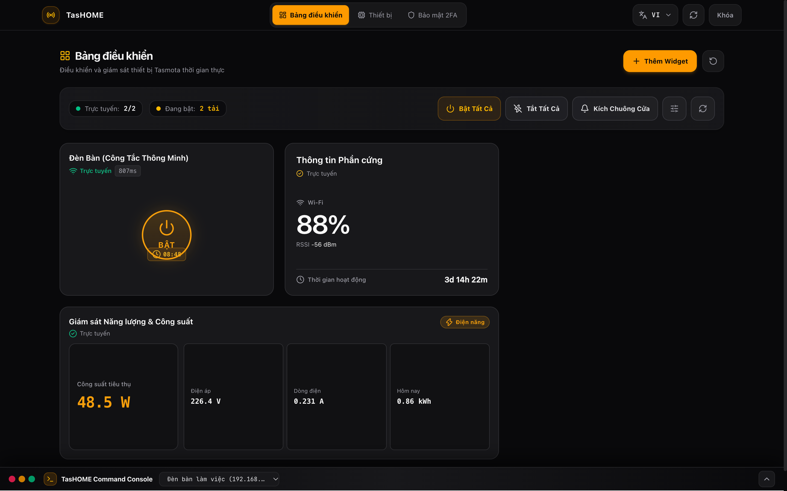
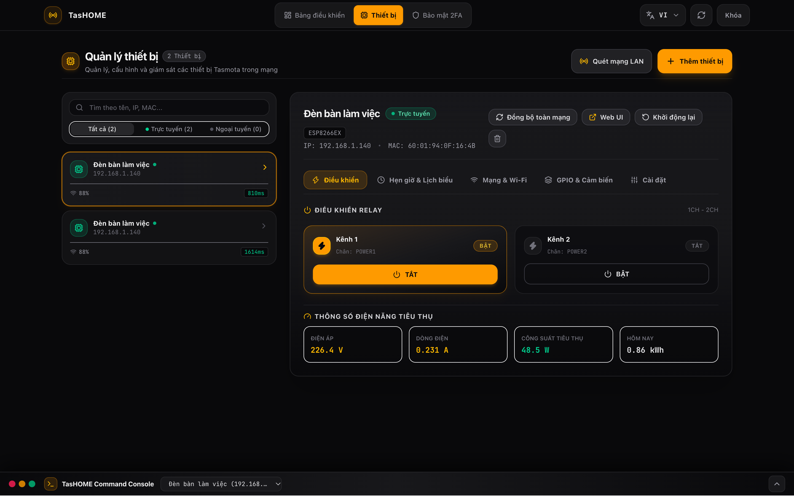

# TasHOME

> Modern, lightweight Smart Home Relay WebApp & Dashboard for Tasmota & ESP8266/ESP32 devices.

[](https://nodejs.org/)
[](https://react.dev/)
[](https://vitejs.dev/)
[](https://tailwindcss.com/)
[](LICENSE)

## Overview

**TasHOME** is a high-performance, privacy-first local smart home dashboard designed to control and monitor Tasmota-flashed microcontrollers (ESP8266 / ESP32, WMH-8266 relays, Sonoff switches, and smart power plugs).

It exists to provide a snappy, modern alternative to clunky native device web interfaces without requiring any cloud connections or third-party IoT servers. With responsive container-query grid layouts, bi-directional countdown timers, real-time energy telemetry, and automated subnet scanning, TasHOME brings desktop-grade control to your home network.

## Demo

To run a local demo:

1. Clone and install dependencies (`npm install`).
2. Start the dev server: `npm run dev`.
3. Open `http://localhost:5173/` in your browser.
4. For production mode with zero-dependency Node backend: `npm run build && npm start`.
5. Access `http://localhost:3000/` and authenticate using your RFC 6238 TOTP authenticator app.

## Screenshots

<!-- Add screenshots here -->
| Dashboard Grid & Mitosis Widget | Energy Monitoring & Telemetry |
| :---: | :---: |
|  |  |

## Features

- **Biological Mitosis Cell Division Toggle**: 2-second hover preparation with pure GPU-accelerated breathing halo, splitting into symmetrical power toggle and context-aware timer buttons with zero layout shift.
- **Context-Aware PulseTime & Delay Timers**: Automatically switches between "Turn OFF" countdown (when relay is active) and "Turn ON" delayed scheduling (when relay is inactive).
- **Responsive 9-Size Bento Grid (1×1 to 3×3)**: Fluid CSS Container Queries (`@container relay`) adapting layout density from mobile phones to ultra-wide displays.
- **Energy Monitor Widget**: Real-time tracking of Active Power (W), Voltage (V), Current (A), Apparent/Reactive Power, Power Factor ($\cos \varphi$), and daily/yesterday/total kWh.
- **Hardware & Telemetry Diagnostics**: Real-time Wi-Fi signal (RSSI/dBm), ping latency, system uptime, and live ESP GPIO pinout mapping.
- **LAN Auto-Discovery**: Fast `/24` subnet scanner probing 254 IPs concurrently with 300ms timeout to detect and import Tasmota nodes in one click.
- **1-Tap Quick Action Presets & Scenes**: Broadcast bulk commands (e.g., "All On", "All Off", "Doorbell Pulse") across all active devices via non-blocking `Promise.allSettled`.
- **Integrated Command Console**: Embedded Tasmota CLI with autocompletion, real-time response parsing, and log filtering.
- **Enterprise-Grade Security**: RFC 6238 TOTP two-factor authentication, brute-force rate limiting, and 24-hour HMAC-SHA256 signed `HttpOnly` session cookies.

## Tech Stack

### Frontend
- **Framework**: React 19 (TypeScript)
- **State Management**: Zustand 5
- **Styling**: Tailwind CSS v4 (`@tailwindcss/vite`), CSS Container Queries
- **Icons**: Lucide React
- **Build Tool**: Vite 8

### Backend
- **Runtime**: Node.js >= 18.0.0
- **HTTP Server**: Native `node:http` (zero external npm runtime dependencies)
- **Security & Crypto**: Native `node:crypto` (RFC 6238 TOTP implementation & HMAC-SHA256)

### Database
- **Storage Engine**: Atomic file-backed JSON (`data/devices.json`, `data/dashboards.json`, `data/scenes.json`, `data/settings.json`)

### Infrastructure
- **Network Protocol**: HTTP REST / Tasmota CMND JSON API
- **Deployment**: Systemd service, Docker, Tailscale / Cloudflare Tunnel

## Architecture

```text
Browser Client (Mobile / Desktop)
  │
  ▼
Frontend SPA (React 19 + Tailwind v4 + Container Queries)
  │
  ├── [Direct Local Polling (Optional)] ────────┐
  │                                             │
  ▼                                             ▼
TasHOME Backend Server (Node.js native http)    Tasmota ESP8266 / ESP32
  │                                             │ (Relays, Plugs, Sensors)
  ├── Auth & Session (RFC 6238 TOTP / HMAC)     ▲
  ├── Atomic JSON Data Store (data/*.json)      │
  ├── Subnet Scanner & Proxy Engine ────────────┘
  └── Background ASTRA Poll Scheduler (3s / 30s)
```

## Requirements

- **Runtime**: Node.js `>= 18.0.0`
- **Package Manager**: npm `>= 9.0.0`
- **Target Hardware**: ESP8266 or ESP32 flashed with Tasmota firmware (v9.0+) on the local network

## Installation

### 1. Clone repository

```bash
git clone https://github.com/Tiendepchai/TasHOME.git
cd TasHOME
```

### 2. Install dependencies

```bash
npm install
```

### 3. Configure environment

```bash
cp .env.example .env
```

### 4. Start application

```bash
npm run build
npm start
```

The application will be accessible at `http://localhost:3000`.

## Configuration

| Variable | Required | Default | Description |
|---|---|---|---|
| `PORT` | No | `3000` | Web server listening port |
| `RELAY_HOST` | No | `192.168.1.140` | Default primary Tasmota device IP address |
| `RELAY_PORT` | No | `80` | Default Tasmota HTTP port |
| `SESSION_SECRET` | No | `smarthome-relay-secret-key-32bytes!` | Secret string used for signing 24h HMAC session cookies |

## Usage

1. Start server with `npm start`.
2. Inspect terminal log for initial TOTP Secret or QR Code link:
   ```text
   [ASTRA] Smart Home server running at http://0.0.0.0:3000
   [2FA] Secret Key: JBSWY3DPEHPK3PXP
   [2FA] OTPAuth: otpauth://totp/TasHOME:admin?secret=JBSWY3DPEHPK3PXP&issuer=TasHOME
   ```
3. Add the secret key to Google Authenticator or 1Password.
4. Open `http://localhost:3000`, enter the 6-digit code, and start managing relays.

## Project Structure

```text
TasHOME/
├── data/                      # Atomic JSON data files (devices, dashboards, scenes, settings)
├── dist/                      # Production SPA bundle generated by Vite
├── src/
│   ├── core/                  # Core modules (auth, http client, i18n, config)
│   │   ├── auth/              # RFC 6238 TOTP generator, rate limiting, session manager
│   │   ├── config/            # Application constants and defaults
│   │   ├── http/              # Tasmota HTTP client & ASTRA poll scheduler
│   │   └── i18n/              # Multi-language translations (vi, en, de)
│   ├── features/              # Feature modules
│   │   ├── auth/              # 2FA verification & settings pages
│   │   ├── dashboard/         # Dashboard layout grid, add-widget modal, quick actions
│   │   ├── devices/           # Device manager, subnet discovery, timer schedule tabs
│   │   └── widgets/           # Modular widgets (relay-toggle, energy-monitor, device-info, sensor)
│   └── shared/                # Shared UI components, hooks, and parsers
├── .env.example               # Template environment configuration
├── package.json               # Dependencies and scripts
├── server.js                  # Production Node.js backend server
├── tsconfig.json              # TypeScript compilation configuration
├── vite.config.ts             # Vite build & proxy configuration
└── README.md                  # Project documentation
```

## API / Integration

TasHOME provides secure, authenticated REST endpoints under `/api`:

| Method | Endpoint | Description |
|---|---|---|
| `POST` | `/api/auth/login` | Authenticate with 6-digit TOTP code; sets `smarthome_session` cookie |
| `POST` | `/api/auth/logout` | Revoke session cookie |
| `GET` | `/api/auth/2fa` | Get current TOTP secret, QR code URI, and cycle remaining seconds |
| `GET` | `/api/devices` | List all managed Tasmota devices and relay labels |
| `POST` | `/api/devices` | Add new device or batch import discovered devices |
| `DELETE` | `/api/devices/:id` | Remove device from registry and cascade cleanup from widgets |
| `GET` | `/api/devices/discover` | Scan local `/24` subnet for Tasmota nodes (`?subnet=192.168.1`) |
| `GET` | `/api/dashboards` | Retrieve widget positions, spans (col/row), and dashboard layout |
| `POST` | `/api/dashboards` | Save updated dashboard layout |
| `GET` | `/api/scenes` | Get all saved 1-tap quick action scenes |
| `POST` | `/api/scenes/:id/execute` | Execute scene commands concurrently across target devices |
| `POST` | `/api/tasmota/cm` | Execute raw Tasmota command (`{"command": "Power1 ON"}`) |
| `ALL` | `/device-proxy/:ip/*` | Authenticated reverse proxy forwarding requests directly to Tasmota device |

## Development

```bash
# Start frontend Vite development server with HMR
npm run dev

# Build production bundle
npm run build

# Preview production build locally
npm run preview
```

## Testing

```bash
# Run unit tests for state parsing and authentication utilities
node test.js
```

> **Note**: Avoid running test suites that rotate `.totp_secret` in production to prevent desynchronizing your active 2FA authenticator.

## Deployment

### Production Server (Systemd)

1. Build assets and verify server:
   ```bash
   npm run build
   ```
2. Create systemd service unit `/etc/systemd/system/tashome.service`:
   ```ini
   [Unit]
   Description=TasHOME Smart Home Relay Server
   After=network.target

   [Service]
   Type=simple
   User=tien
   WorkingDirectory=/opt/smarthome
   ExecStart=/usr/bin/node /opt/smarthome/server.js
   Restart=always
   RestartSec=5
   Environment=PORT=3000

   [Install]
   WantedBy=multi-user.target
   ```
3. Enable and start:
   ```bash
   sudo systemctl daemon-reload
   sudo systemctl enable --now tashome
   ```

## Roadmap

- [x] Responsive 9-size container query grid layout (1×1 to 3×3)
- [x] Biological mitosis cell division power toggle with 2s hover halo
- [x] Context-aware bi-directional timers (Auto-Off / Auto-On via Tasmota PulseTime & Delay)
- [x] Real-time Energy Monitoring widget (W, V, A, kWh, Power Factor)
- [x] Automated `/24` subnet auto-discovery scanner
- [x] RFC 6238 TOTP 2FA authentication and rate-limiting protection
- [x] 1-Tap quick action scenes with parallel non-blocking execution
- [ ] MQTT broker integration for instantaneous push telemetry
- [ ] Historical energy logging with exportable CSV / chart analytics
- [ ] Native HomeKit / Matter bridge support

## Contributing

Contributions are welcome. Please open an issue to discuss proposed changes or submit pull requests with clear descriptions and test proof.

## Security

Do not report security vulnerabilities through public issues. For sensitive vulnerabilities, please contact the maintainer directly via GitHub security advisories.

## License

Distributed under the [MIT](LICENSE) License.

## Maintainers

- Tien Nguyen — [@Tiendepchai](https://github.com/Tiendepchai)

## Acknowledgements

- [Tasmota](https://tasmota.github.io/docs/) — Open-source firmware for ESP devices.
- [Lucide](https://lucide.dev/) — Clean, consistent icons.
- [Tailwind CSS](https://tailwindcss.com/) — Utility-first CSS framework.
- [Vite](https://vitejs.dev/) — Next generation frontend tooling.
